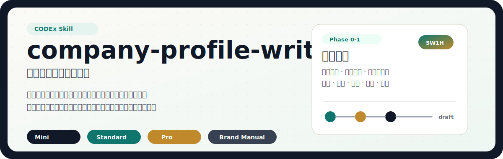
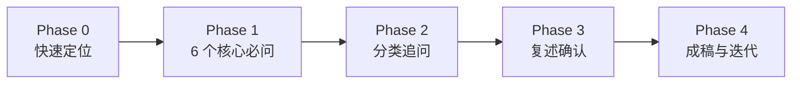

<p align="center">
  
</p>

<p align="center">
  初创企业 · 成熟企业 · 官网介绍 · 招商合作 · 融资路演 · 品牌手册<br>
  <strong>先问后写，按阶段选公式，用事实支撑表达</strong>
</p>

`company-profile-writer` 是一个面向 Codex / Claude Code 的中文企业简介撰写 Skill。它不会直接凭空写一段“高大上”的公司介绍，而是先收集企业基本盘、业务定位、差异化优势、硬实力证据和使命愿景，再根据企业阶段与使用场景输出可改稿、可落地的公司介绍文案。

> [!IMPORTANT]
> 每次正式撰写前，必须先完成核心信息收集。没有用户确认的收入、客户数、专利、荣誉、排名、融资等信息，不会被写成事实背书。

## 它适合什么

| 需求 | 输出 |
| --- | --- |
| 社交媒体、名片、短视频口播 | 30-80 字 Mini 一句话版 |
| 官网“关于我们”、招商手册、合作 PPT | 300-800 字标准版 |
| 品牌手册、投资路演、深度宣传 | 800-2000 字完整版 / Pro 版 |
| 画册、发布会资料、融资计划书 | 模块化品牌手册框架与文案 |

典型触发语：

- “帮我写一份公司简介”
- “给初创公司写企业介绍”
- “写招商 / 官网 / 发布会 / 融资用的公司介绍”
- “高端品牌手册文案怎么写”
- “给我们公司写个一句话介绍”

## 为什么它更稳

这个 Skill 的核心不是套模板，而是把企业信息先整理成可信写作基线：

1. **快速定位**：先判断企业处于初创阶段，还是已有规模和行业地位。
2. **核心必问**：一次性收集公司基本盘、定位、业务、优势、证据、使命愿景。
3. **分类追问**：初创企业补充创始团队和客户证明，成熟企业补充里程碑和行业地位。
4. **复述确认**：写作前先复述理解，让用户确认事实和方向。
5. **按公式撰写**：根据场景选择 Mini 公式、5W1H、三段论或品牌手册框架。



## 必收信息

| 信息 | 说明 |
| --- | --- |
| 公司基本盘 | 公司全称、成立年份、总部或主要市场 |
| 一句话定位 | 公司做什么，处在哪个品类或赛道 |
| 核心业务 | 主要产品或服务，以及服务的客户群体 |
| 差异化优势 | 相比同行最清晰的长板 |
| 硬实力证据 | 收入、用户、客户、专利、荣誉、渠道、合作伙伴、融资等事实 |
| 灵魂三问 | 使命、愿景、价值观 |

如果第 5 项暂时没有数据，Skill 会追问团队背景、用户口碑、合作方、行业认可等替代证据，而不是用空泛形容词补位。

## 写作逻辑

### 初创企业

初创企业优先使用 5W1H 和“扬长避短，强化特色；虚实结合，初心主张”的策略：

| 维度 | 写作落点 |
| --- | --- |
| Who | 公司定位、品牌身份 |
| When | 成立时间、发展阶段 |
| Where | 总部、市场、渠道覆盖 |
| What | 产品、服务、业务范围 |
| Why | 初心、使命、价值观 |
| How | 核心优势、方法、模式或技术 |

### 成熟 / 高端企业

成熟企业优先使用“我是谁 -> 我多强 -> 去哪了”的三段论：

| 段落 | 内容 |
| --- | --- |
| 我是谁 | 公司名称、成立时间、核心定位、主营业务 |
| 我多强 | 核心优势、关键数据、资质荣誉、案例成果 |
| 去哪了 | 使命愿景、战略方向、合作展望 |

## 快速使用

在对话中直接提出需求：

```text
使用 $company-profile-writer，帮我写一份官网用的公司简介。
```

如果你已经有资料，可以一次性给出：

```text
使用 $company-profile-writer。
公司全称：XX 智造科技有限公司
成立年份：2022
主要市场：华东制造业客户
定位：面向中小制造企业的智能排产与数据看板服务商
核心业务：SaaS 系统、实施服务、运营报表
差异化优势：上线快、可按车间流程配置、团队有制造业信息化经验
硬实力证据：服务 30+ 客户，暂无专利和融资
使命愿景价值观：让中小工厂用得起数据化工具；成为制造业轻量数字化伙伴；务实、透明、长期主义
用途：招商合作
版本：标准版
风格：专业、稳重、有科技感
```

Skill 会先复述理解并确认，再开始正式撰写。

## 安全边界

- 不跳过信息收集直接成稿。
- 不把未经确认的数据写成事实。
- 不直接采用“行业领先”“一流品牌”等没有证据的表达。
- 不让初创企业硬装成熟，也不让成熟企业过度煽情。
- 输出会标注段落用途，方便继续局部改写。

## 开发与资料

- [Skill 主流程](SKILL.md)
- [初创企业公司简介方法论](references/startup-profile-framework.md)
- [高端 / 成熟企业公司简介方法论](references/enterprise-profile-framework.md)

## 文件结构

```text
company-profile-writer/
├── README.md
├── SKILL.md
├── assets/
│   └── readme/
│       └── hero.svg
└── references/
    ├── enterprise-profile-framework.md
    └── startup-profile-framework.md
```

## License

当前目录未包含 license 文件。公开发布或分发前建议补充明确许可证。
